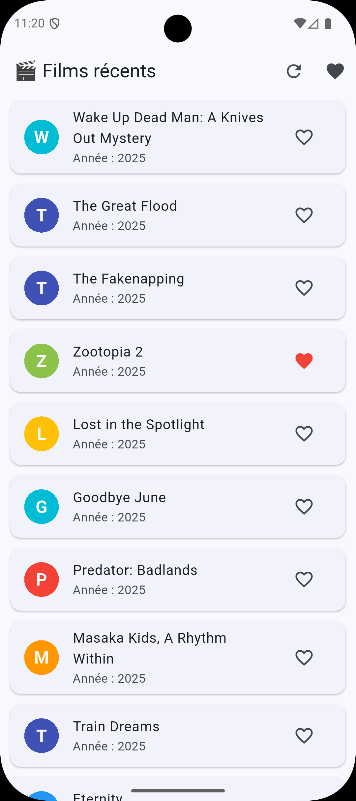
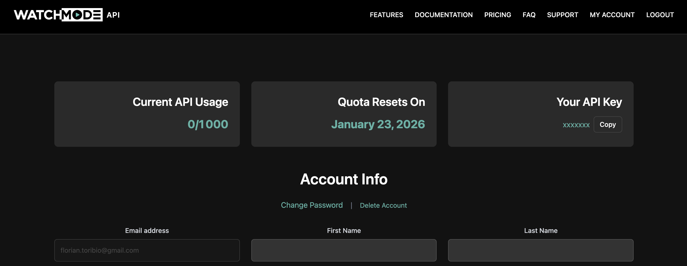
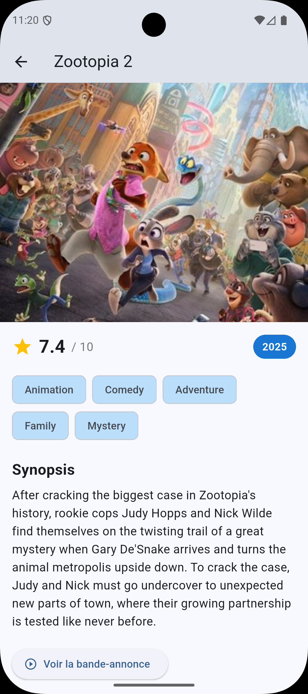

# 🧱 TP4 – Liste de films avec API (Watchmode) et Dio

## 🎯 Objectifs
- Reprendre le projet du TP3 et le faire évoluer vers une API réelle
- Utiliser **Dio** pour effectuer des requêtes HTTP
- Intégrer l'API **Watchmode** pour récupérer des films
- Gérer les états de chargement et les erreurs réseau
- Afficher des données dynamiques provenant d'une source externe
- Combiner plusieurs appels API (liste + détails)

🕐 **Durée estimée : 2 à 3 heures**



---

## 🪜 Étape 1 — Préparer le projet

### Option A : Partir du TP3 (recommandé)

Si tu as déjà fait le TP3, tu vas migrer ton projet vers une API réelle.

1. **Copie ton projet TP3** dans un nouveau dossier :
   ```bash
   cp -r tp3_nom_prenom tp4_nom_prenom
   cd tp4_nom_prenom
   ```

2. **Réorganise la structure** (on va créer des dossiers plus propres) :
   ```bash
   mkdir -p lib/models lib/services lib/pages
   ```

3. **Migration des fichiers** :
   - **Supprime** `lib/service/movie_service.dart` (on va le réécrire pour l'API)
   - **Supprime** `assets/data/movies.json` (on n'utilise plus le JSON local)
   - **Déplace** `lib/movie_list_page.dart` vers `lib/pages/movie_list_page.dart`
   - **Supprime** les références à `assets/data/movies.json` dans `pubspec.yaml`

4. **Ajoute les dépendances Dio et url_launcher** dans `pubspec.yaml` :
   ```yaml
   dependencies:
     flutter:
       sdk: flutter
     dio: ^5.9.0
     url_launcher: ^6.3.2
   ```

5. **Mets à jour les packages** :
   ```bash
   flutter pub get
   ```

### Option B : Créer un nouveau projet

Si tu préfères repartir de zéro :

1. Crée un nouveau projet :
   ```bash
   flutter create tp4_nom_prenom
   cd tp4_nom_prenom
   ```

2. Crée la structure de dossiers :
   ```bash
   mkdir -p lib/models lib/services lib/pages
   ```

3. Ajoute les dépendances **Dio** et **url_launcher** dans `pubspec.yaml` :
   ```yaml
   dependencies:
     flutter:
       sdk: flutter
     dio: ^5.9.0
     url_launcher: ^6.2.0
   ```

4. Mets à jour les packages :
   ```bash
   flutter pub get
   ```

### Obtenir la clé API Watchmode (ou autre si tu préfères)



- Va sur https://api.watchmode.com/
- Crée un compte gratuit
- Récupère ta clé API depuis ton dashboard
- Le plan gratuit te permet 1000 requêtes par mois, largement suffisant pour ce TP

> **💡 Packages utilisés :**
> - **Dio** : Package pour faire des requêtes HTTP (appeler des APIs). Il est plus complet que le package de base `http` : gestion automatique des erreurs, timeouts, intercepteurs, etc. C'est l'équivalent d'Axios en JavaScript.
> - **url_launcher** : Permet d'ouvrir des URLs externes (sites web, YouTube, etc.) depuis l'application. Très utile pour ouvrir les bandes-annonces des films.

---

## 🪜 Étape 2 — Créer les modèles pour l'API Watchmode

L'API Watchmode fonctionne en deux étapes :
1. **Liste des films** : retourne uniquement `id`, `title`, `year` (pas de poster ni description)
2. **Détails d'un film** : retourne toutes les informations complètes

Crée un fichier `lib/models/movie.dart` :

```dart
// Modèle simplifié pour la liste des films
class MovieListItem {
  final int id;
  final String title;
  final int year;

  MovieListItem({
    required this.id,
    required this.title,
    required this.year,
  });

  factory MovieListItem.fromJson(Map<String, dynamic> json) {
    return MovieListItem(
      id: json['id'],
      title: json['title'] ?? 'Sans titre',
      year: json['year'] ?? 0,
    );
  }
}

// Modèle complet pour les détails d'un film
class Movie {
  final int id;
  final String title;
  final String plotOverview;
  final int year;
  final String? poster;
  final String? backdrop;
  final double userRating;
  final List<String> genreNames;
  final String? trailer;

  Movie({
    required this.id,
    required this.title,
    required this.plotOverview,
    required this.year,
    this.poster,
    this.backdrop,
    required this.userRating,
    required this.genreNames,
    this.trailer,
  });

  factory Movie.fromJson(Map<String, dynamic> json) {
    return Movie(
      id: json['id'],
      title: json['title'] ?? 'Sans titre',
      plotOverview: json['plot_overview'] ?? 'Aucune description disponible',
      year: json['year'] ?? 0,
      poster: json['poster'],
      backdrop: json['backdrop'],
      userRating: (json['user_rating'] ?? 0).toDouble(),
      genreNames: (json['genre_names'] as List<dynamic>?)
              ?.map((e) => e.toString())
              .toList() ??
          [],
      trailer: json['trailer'],
    );
  }

  String get posterUrl =>
      poster ?? 'https://placehold.co/600x400';

  String get backdropUrl =>
      backdrop ?? 'https://placehold.co/600x400';
}
```

> **💡 Notions clés expliquées :**
> - **Deux modèles séparés** : `MovieListItem` pour la liste (léger), `Movie` pour les détails (complet). C'est une bonne pratique pour optimiser les performances.
> - **`String?`** : Le `?` signifie "nullable" (peut être null). Certains films n'ont pas de poster, donc `poster` peut être null.
> - **`as List<dynamic>?`** : Cast (conversion de type) avec possibilité de null. On dit "traite ça comme une liste, ou null si c'est pas une liste".
> - **`?.map()`** : L'opérateur `?.` (null-aware) exécute `map()` uniquement si la liste n'est pas null. Sinon il retourne null.
> - **`?? []`** : L'opérateur `??` (null-coalescing) retourne la valeur de gauche si elle n'est pas null, sinon la valeur de droite (ici une liste vide).
> - **getter** : `get posterUrl` est une propriété calculée. Elle se comporte comme une variable mais calcule une valeur à chaque accès.

---

## 🪜 Étape 3 — Créer le service API Watchmode avec Dio

Crée un fichier `lib/services/movie_service.dart` :

```dart
import 'package:dio/dio.dart';
import '../models/movie.dart';

class MovieService {
  final Dio _dio = Dio();
  static const String _baseUrl = 'https://api.watchmode.com/v1';

  // Récupère la clé API depuis les variables d'environnement
  static const String _apiKey = String.fromEnvironment(
    'WATCHMODE_API_KEY',
    defaultValue: '', // Valeur par défaut si la clé n'est pas fournie
  );

  Future<List<MovieListItem>> getMovies({int limit = 20}) async {
    // Vérifie que la clé API est bien fournie
    if (_apiKey.isEmpty) {
      throw Exception(
        'Clé API manquante ! Lance l\'app avec --dart-define=WATCHMODE_API_KEY=ta_clé'
      );
    }

    try {
      final response = await _dio.get(
        '$_baseUrl/list-titles/',
        queryParameters: {
          'apiKey': _apiKey,
          'types': 'movie',
          'limit': limit,
        },
      );

      if (response.statusCode == 200) {
        final List<dynamic> titles = response.data['titles'];
        return titles.map((json) => MovieListItem.fromJson(json)).toList();
      } else {
        throw Exception('Erreur lors du chargement des films');
      }
    } catch (e) {
      throw Exception('Erreur réseau : $e');
    }
  }

  Future<Movie> getMovieDetails(int movieId) async {
    if (_apiKey.isEmpty) {
      throw Exception(
        'Clé API manquante ! Lance l\'app avec --dart-define=WATCHMODE_API_KEY=ta_clé'
      );
    }

    try {
      final response = await _dio.get(
        '$_baseUrl/title/$movieId/details/',
        queryParameters: {
          'apiKey': _apiKey,
        },
      );

      if (response.statusCode == 200) {
        return Movie.fromJson(response.data);
      } else {
        throw Exception('Erreur lors du chargement des détails');
      }
    } catch (e) {
      throw Exception('Erreur réseau : $e');
    }
  }
}
```

**Exemple de réponse de l'API :**

Liste des films (`/list-titles/`) :
```json
{
  "titles": [
    {
      "id": 1634288,
      "title": "Wake Up Dead Man: A Knives Out Mystery",
      "year": 2025,
      "imdb_id": "tt14364480",
      "tmdb_id": 812583,
      "type": "movie"
    },
    {
      "id": 1886541,
      "title": "The Great Flood",
      "year": 2025,
      "imdb_id": "tt29927663",
      "tmdb_id": 982843,
      "type": "movie"
    }
  ]
}
```

Détails d'un film (`/title/1874486/details/`) :
```json
{
  "id": 1874486,
  "title": "Predator: Killer of Killers",
  "plot_overview": "While three of the fiercest warriors in human history...",
  "year": 2025,
  "user_rating": 7.6,
  "genre_names": ["Animation", "Action", "Science Fiction"],
  "poster": "https://cdn.watchmode.com/posters/01874486_poster_w342.jpg",
  "backdrop": null,
  "trailer": "https://www.youtube.com/watch?v=s2XXEbtT1fo"
}
```

### Comment lancer l'application avec ta clé API

**En ligne de commande :**
```bash
flutter run --dart-define=WATCHMODE_API_KEY=ta_clé_api_ici
```

**Dans VS Code :**

Crée un fichier `.vscode/launch.json` à la racine du projet :

```json
{
  "version": "0.2.0",
  "configurations": [
    {
      "name": "Flutter (Development)",
      "request": "launch",
      "type": "dart",
      "args": [
        "--dart-define=WATCHMODE_API_KEY=ta_clé_api_ici"
      ]
    }
  ]
}
```

**Dans Android Studio :**

1. Va dans **Run** → **Edit Configurations**
2. Dans **Additional run args**, ajoute : `--dart-define=WATCHMODE_API_KEY=ta_clé_api_ici`

> - **💡 Notions clés expliquées :**
> - **String.fromEnvironment()** : Récupère une variable passée en ligne de commande avec `--dart-define`. C'est comme demander "est-ce qu'on m'a donné une valeur pour cette clé ?"
> - **--dart-define** : Permet de passer des variables au moment de la compilation. Contrairement aux variables d'environnement classiques, elles sont intégrées dans le code compilé
> - **Validation `if (_apiKey.isEmpty)`** : Vérifie qu'une clé a bien été fournie avant de faire l'appel API
> - **try-catch** : Gère les erreurs. Le code dans `try` est exécuté, si une erreur survient, on saute dans `catch`.

> **Pourquoi ne PAS hardcoder la clé API ?**
> - **Sécurité** : Si tu push ton code sur GitHub, tout le monde voit ta clé
> - **Révocation** : Si ta clé fuit, elle peut être utilisée par n'importe qui
> - **Bonnes pratiques** : En entreprise, JAMAIS de secrets dans le code
> - **Flexibilité** : Tu peux utiliser différentes clés (dev, prod) sans changer le code

---

## 🪜 Étape 4 — Créer la page de liste avec gestion des états

Crée un fichier `lib/pages/movie_list_page.dart` :

```dart
import 'package:flutter/material.dart';
import '../models/movie.dart';
import '../services/movie_service.dart';
import 'movie_detail_page.dart';

class MovieListPage extends StatefulWidget {
  final MovieService movieService;

  const MovieListPage({super.key, required this.movieService});

  @override
  State<MovieListPage> createState() => _MovieListPageState();
}

class _MovieListPageState extends State<MovieListPage> {
  List<MovieListItem> movies = [];
  bool isLoading = true;
  String? errorMessage;
  final Set<int> favorites = {};

  @override
  void initState() {
    super.initState();
    _loadMovies();
  }

  Future<void> _loadMovies() async {
    setState(() {
      isLoading = true;
      errorMessage = null;
    });

    try {
      final loadedMovies = await widget.movieService.getMovies(limit: 30);
      setState(() {
        movies = loadedMovies;
        isLoading = false;
      });
    } catch (e) {
      setState(() {
        errorMessage = e.toString();
        isLoading = false;
      });
    }
  }

  void toggleFavorite(int movieId) {
    setState(() {
      favorites.contains(movieId) ? favorites.remove(movieId) : favorites.add(movieId);
    });
  }

  @override
  Widget build(BuildContext context) {
    return Scaffold(
      appBar: AppBar(
        title: const Text('🎬 Films récents'),
        actions: [
          IconButton(
            icon: const Icon(Icons.refresh),
            onPressed: _loadMovies,
          ),
          IconButton(
            icon: const Icon(Icons.favorite),
            onPressed: () => Navigator.push(
              context,
              MaterialPageRoute(
                builder: (_) => FavoritesPage(
                  movieService: widget.movieService,
                  favorites: favorites,
                  movies: movies,
                  toggleFavorite: toggleFavorite,
                ),
              ),
            ),
          ),
        ],
      ),
      body: isLoading
          ? const Center(child: CircularProgressIndicator())
          : errorMessage != null
              ? Center(
                  child: Column(
                    mainAxisAlignment: MainAxisAlignment.center,
                    children: [
                      const Icon(Icons.error_outline, size: 60, color: Colors.red),
                      const SizedBox(height: 16),
                      Text(errorMessage!, textAlign: TextAlign.center),
                      const SizedBox(height: 16),
                      ElevatedButton(
                        onPressed: _loadMovies,
                        child: const Text('Réessayer'),
                      ),
                    ],
                  ),
                )
              : ListView.builder(
                  itemCount: movies.length,
                  itemBuilder: (context, index) => MovieListCard(
                    movieService: widget.movieService,
                    movie: movies[index],
                    isFavorite: favorites.contains(movies[index].id),
                    onFavoriteTap: () => toggleFavorite(movies[index].id),
                  ),
                ),
    );
  }
}

class FavoritesPage extends StatefulWidget {
  final MovieService movieService;
  final Set<int> favorites;
  final List<MovieListItem> movies;
  final void Function(int) toggleFavorite;

  const FavoritesPage({
    super.key,
    required this.movieService,
    required this.favorites,
    required this.movies,
    required this.toggleFavorite,
  });

  @override
  State<FavoritesPage> createState() => _FavoritesPageState();
}

class _FavoritesPageState extends State<FavoritesPage> {
  void _removeFavorite(int movieId) {
    widget.toggleFavorite(movieId);
    setState(() {});
  }

  @override
  Widget build(BuildContext context) {
    final favMovies = widget.movies.where((m) => widget.favorites.contains(m.id)).toList();

    return Scaffold(
      appBar: AppBar(title: const Text('❤️ Mes favoris')),
      body: favMovies.isEmpty
          ? const Center(child: Text('Aucun favori pour le moment.'))
          : ListView.builder(
              itemCount: favMovies.length,
              itemBuilder: (context, index) => MovieListCard(
                movieService: widget.movieService,
                movie: favMovies[index],
                isFavorite: true,
                onFavoriteTap: () => _removeFavorite(favMovies[index].id),
                favoriteIcon: Icons.delete,
              ),
            ),
    );
  }
}

class MovieListCard extends StatelessWidget {
  final MovieService movieService;
  final MovieListItem movie;
  final bool isFavorite;
  final VoidCallback onFavoriteTap;
  final IconData? favoriteIcon;

  const MovieListCard({
    super.key,
    required this.movieService,
    required this.movie,
    required this.isFavorite,
    required this.onFavoriteTap,
    this.favoriteIcon,
  });

  // Génère une couleur basée sur la première lettre du titre
  Color _getColorFromLetter(String title) {
    if (title.isEmpty) return Colors.grey;

    final letter = title[0].toUpperCase();
    final colorIndex = letter.codeUnitAt(0) % 10;

    const colors = [
      Colors.red,
      Colors.pink,
      Colors.purple,
      Colors.deepPurple,
      Colors.indigo,
      Colors.blue,
      Colors.teal,
      Colors.green,
      Colors.orange,
      Colors.brown,
    ];

    return colors[colorIndex];
  }

  @override
  Widget build(BuildContext context) {
    return Card(
      margin: const EdgeInsets.symmetric(horizontal: 12, vertical: 6),
      child: InkWell(
        onTap: () => Navigator.push(
          context,
          MaterialPageRoute(
            builder: (_) => MovieDetailPage(
              movieService: movieService,
              movieId: movie.id,
            ),
          ),
        ),
        child: ListTile(
          leading: CircleAvatar(
            backgroundColor: _getColorFromLetter(movie.title),
            child: Text(
              movie.title.isNotEmpty ? movie.title[0].toUpperCase() : '?',
              style: const TextStyle(
                color: Colors.white,
                fontWeight: FontWeight.bold,
                fontSize: 20,
              ),
            ),
          ),
          title: Text(movie.title),
          subtitle: Text('Année : ${movie.year}'),
          trailing: IconButton(
            icon: Icon(
              favoriteIcon ?? (isFavorite ? Icons.favorite : Icons.favorite_border),
              color: isFavorite && favoriteIcon == null ? Colors.red : null,
            ),
            onPressed: onFavoriteTap,
          ),
        ),
      ),
    );
  }
}
```

> **💡 Notions clés expliquées :**
> - **3 états** : `isLoading`, `errorMessage`, et les données. C'est le pattern classique pour gérer les appels API : chargement → succès OU erreur.
> - **Extraction de widget** : `MovieListCard` est un widget séparé réutilisable, comme dans le TP3. Améliore la lisibilité et la maintenabilité.
> - **Passage du service** : Le service est passé en paramètre à travers tous les widgets (MovieListPage → MovieListCard → MovieDetailPage). C'est le pattern de "prop drilling". Pour des apps plus complexes, on utiliserait Provider ou Riverpod.
> - **InkWell** : Rend le widget cliquable avec un effet de ripple (vague) Material Design au toucher.
> - **Navigation vers les détails** : On passe l'ID du film, pas l'objet complet. La page de détails fera un appel API pour récupérer toutes les informations (poster, synopsis, genres, etc.).

---

## 🪜 Étape 5 — Créer la page de détails avec chargement dynamique

Crée un fichier `lib/pages/movie_detail_page.dart` :

```dart
import 'package:flutter/material.dart';
import 'package:url_launcher/url_launcher.dart';
import '../models/movie.dart';
import '../services/movie_service.dart';

class MovieDetailPage extends StatefulWidget {
  final MovieService movieService;
  final int movieId;

  const MovieDetailPage({
    super.key,
    required this.movieService,
    required this.movieId,
  });

  @override
  State<MovieDetailPage> createState() => _MovieDetailPageState();
}

class _MovieDetailPageState extends State<MovieDetailPage> {
  Movie? movie;
  bool isLoading = true;
  String? errorMessage;

  @override
  void initState() {
    super.initState();
    _loadMovieDetails();
  }

  Future<void> _loadMovieDetails() async {
    setState(() {
      isLoading = true;
      errorMessage = null;
    });

    try {
      final loadedMovie = await widget.movieService.getMovieDetails(widget.movieId);
      setState(() {
        movie = loadedMovie;
        isLoading = false;
      });
    } catch (e) {
      setState(() {
        errorMessage = e.toString();
        isLoading = false;
      });
    }
  }

  Future<void> _openTrailer() async {
    if (movie?.trailer == null) return;

    final uri = Uri.parse(movie!.trailer!);

    if (await canLaunchUrl(uri)) {
      await launchUrl(uri, mode: LaunchMode.externalApplication);
    } else {
      if (!mounted) return;
      ScaffoldMessenger.of(context).showSnackBar(
        const SnackBar(
          content: Text('Impossible d\'ouvrir la bande-annonce'),
          backgroundColor: Colors.red,
        ),
      );
    }
  }

  @override
  Widget build(BuildContext context) {
    return Scaffold(
      appBar: AppBar(
        title: Text(movie?.title ?? 'Chargement...'),
      ),
      body: isLoading
          ? const Center(child: CircularProgressIndicator())
          : errorMessage != null
              ? Center(
                  child: Column(
                    mainAxisAlignment: MainAxisAlignment.center,
                    children: [
                      const Icon(Icons.error_outline, size: 60, color: Colors.red),
                      const SizedBox(height: 16),
                      Text(errorMessage!, textAlign: TextAlign.center),
                      const SizedBox(height: 16),
                      ElevatedButton(
                        onPressed: _loadMovieDetails,
                        child: const Text('Réessayer'),
                      ),
                    ],
                  ),
                )
              : SingleChildScrollView(
                  child: Column(
                    crossAxisAlignment: CrossAxisAlignment.start,
                    children: [
                      // Image du poster
                      Image.network(
                        movie!.posterUrl,
                        width: double.infinity,
                        height: 500,
                        fit: BoxFit.cover,
                        errorBuilder: (_, __, ___) => Container(
                          height: 500,
                          color: Colors.grey[300],
                          child: const Icon(Icons.movie, size: 100),
                        ),
                      ),
                      Padding(
                        padding: const EdgeInsets.all(16),
                        child: Column(
                          crossAxisAlignment: CrossAxisAlignment.start,
                          children: [
                            // Note et année
                            Row(
                              children: [
                                const Icon(Icons.star, color: Colors.amber, size: 28),
                                const SizedBox(width: 8),
                                Text(
                                  movie!.userRating.toStringAsFixed(1),
                                  style: const TextStyle(
                                    fontSize: 24,
                                    fontWeight: FontWeight.bold,
                                  ),
                                ),
                                const SizedBox(width: 8),
                                Text(
                                  '/ 10',
                                  style: TextStyle(
                                    fontSize: 16,
                                    color: Colors.grey[600],
                                  ),
                                ),
                                const Spacer(),
                                Container(
                                  padding: const EdgeInsets.symmetric(
                                    horizontal: 12,
                                    vertical: 6,
                                  ),
                                  decoration: BoxDecoration(
                                    color: Colors.blue[700],
                                    borderRadius: BorderRadius.circular(20),
                                  ),
                                  child: Text(
                                    '${movie!.year}',
                                    style: const TextStyle(
                                      color: Colors.white,
                                      fontWeight: FontWeight.bold,
                                    ),
                                  ),
                                ),
                              ],
                            ),
                            const SizedBox(height: 16),
                            // Genres
                            if (movie!.genreNames.isNotEmpty) ...[
                              Wrap(
                                spacing: 8,
                                children: movie!.genreNames
                                    .map((genre) => Chip(
                                          label: Text(genre),
                                          backgroundColor: Colors.blue[100],
                                        ))
                                    .toList(),
                              ),
                              const SizedBox(height: 20),
                            ],
                            // Synopsis
                            const Text(
                              'Synopsis',
                              style: TextStyle(
                                fontSize: 20,
                                fontWeight: FontWeight.bold,
                              ),
                            ),
                            const SizedBox(height: 8),
                            Text(
                              movie!.plotOverview,
                              style: const TextStyle(fontSize: 16, height: 1.5),
                            ),
                            // Bouton bande-annonce si disponible
                            if (movie!.trailer != null) ...[
                              const SizedBox(height: 20),
                              ElevatedButton.icon(
                                onPressed: _openTrailer,
                                icon: const Icon(Icons.play_circle_outline),
                                label: const Text('Voir la bande-annonce'),
                                style: ElevatedButton.styleFrom(
                                  backgroundColor: Colors.red,
                                  foregroundColor: Colors.white,
                                  padding: const EdgeInsets.symmetric(
                                    horizontal: 24,
                                    vertical: 12,
                                  ),
                                ),
                              ),
                            ],
                          ],
                        ),
                      ),
                    ],
                  ),
                ),
    );
  }
}
```



> **💡 Notions clés expliquées :**
> - **Chargement dynamique** : La page ne reçoit que l'ID du film et fait elle-même l'appel API pour récupérer les détails. C'est plus flexible et économise de la mémoire.
> - **`Movie?`** : Le `?` indique que `movie` peut être null (pendant le chargement ou en cas d'erreur).
> - **`movie?.title ?? 'Chargement...'`** : Opérateur null-safe. Si `movie` est null, retourne 'Chargement...', sinon retourne le titre.
> - **`movie!.userRating`** : Le `!` (null assertion) dit "je sais que movie n'est pas null ici". À utiliser uniquement quand on est sûr.
> - **Spread operator `...`** : Le `if (...) ...[widget1, widget2]` ajoute plusieurs widgets conditionnellement. C'est plus propre que des conditions imbriquées.
> - **Wrap** : Layout qui dispose les enfants horizontalement et passe à la ligne si besoin. Parfait pour les listes de genres/tags.
> - **Chip** : Widget Material Design pour afficher des étiquettes (tags, filtres, etc.).
> - **url_launcher** : Package pour ouvrir des URLs externes. `canLaunchUrl()` vérifie si l'URL peut être ouverte, `launchUrl()` l'ouvre dans le navigateur/app externe.
> - **LaunchMode.externalApplication** : Force l'ouverture dans une application externe (navigateur, YouTube app, etc.) au lieu d'un WebView intégré.
> - **if (!mounted) return** : Vérifie si le widget est encore dans l'arbre avant d'afficher une SnackBar. Évite les erreurs si l'utilisateur a quitté la page.

---

## 🪜 Étape 6 — Point d'entrée de l'application

Crée ou modifie le fichier `lib/main.dart` :

```dart
import 'package:flutter/material.dart';
import 'pages/movie_list_page.dart';
import 'services/movie_service.dart';

// Instance globale du service partagée dans toute l'application
final movieService = MovieService();

void main() => runApp(const MyApp());

class MyApp extends StatelessWidget {
  const MyApp({super.key});

  @override
  Widget build(BuildContext context) {
    return MaterialApp(
      title: 'TP4 - Films Watchmode',
      debugShowCheckedModeBanner: false,
      theme: ThemeData(
        colorScheme: ColorScheme.fromSeed(seedColor: Colors.blue),
        useMaterial3: true,
      ),
      home: MovieListPage(movieService: movieService),
    );
  }
}
```

> **💡 Architecture : Instance globale du service**
>
> Dans ce TP, `movieService` est définie comme une **instance globale** et passée en paramètre à tous les widgets qui en ont besoin. Cela garantit qu'une seule instance du service (et donc de Dio) existe dans toute l'application.
>
> **Avantages de cette approche :**
> - ✅ **Une seule instance de Dio** : Optimise les ressources et les connexions réseau
> - ✅ **Cache partagé** : Si on ajoute un cache plus tard, toutes les pages l'utilisent
> - ✅ **Testabilité** : On peut facilement remplacer le service par un mock dans les tests
> - ✅ **Maintenabilité** : Changer la configuration du service se fait en un seul endroit
>
> **❌ À éviter :**
> ```dart
> // Mauvaise pratique : créer une nouvelle instance dans chaque widget
> class _MovieListPageState extends State<MovieListPage> {
>   final MovieService _movieService = MovieService(); // ❌ Crée un nouveau Dio à chaque fois
> }
> ```
>
> Cette approche prépare aussi le terrain pour des patterns plus avancés comme l'injection de dépendances (Provider, Riverpod, GetIt, etc.) que tu verras dans des TPs futurs !

✅ Teste ton application : tu devrais voir une liste de films récents chargés depuis l'API Watchmode !

---

## ✅ Objectif final

À la fin du TP, ton application doit :
- Charger des films depuis l'**API Watchmode** avec **Dio**
- Afficher une liste de films récents avec première lettre colorée et favoris
- Gérer les **états de chargement et d'erreur** sur toutes les pages
- Faire un **second appel API** pour charger les détails complets (poster, synopsis, note, genres)
- Afficher une page de détails riche avec toutes les informations du film
- **Ouvrir les bandes-annonces** dans le navigateur avec **url_launcher**
- Gérer les favoris avec navigation entre liste principale et favoris
- Respecter les **bonnes pratiques** du TP3 (extraction de widgets, gestion d'erreurs, instance globale du service)

---

## 💾 Rendu attendu

- Projet Flutter complet nommé : **`tp4_nom_prenom`**
- Trois captures d'écran :
  - La liste principale des films
  - La page des favoris
  - La page de détails d'un film avec poster et informations complètes
- Lien GitHub du projet
- **Important** : Ne commite PAS ta clé API ! Ajoute `.vscode/` dans ton `.gitignore` et documente comment lancer l'app dans le README

---

## 🧮 Barème de notation

| Critère | Détails | Points |
|----------|----------|--------|
| **Structure du projet** | Organisation claire en `models`, `services`, `pages` | 2 |
| **Intégration API avec Dio** | Deux appels API fonctionnels (liste + détails), clé API sécurisée | 3 |
| **Gestion des états** | Loading, erreur, et données affichées correctement sur les 2 pages | 3 |
| **Affichage de la liste** | Liste avec première lettre colorée, favoris fonctionnels | 2 |
| **Page de détails complète** | Chargement dynamique, poster, note, genres, synopsis | 3 |
| **url_launcher** | Ouverture des bandes-annonces dans le navigateur, gestion d'erreurs | 2 |
| **Extraction de widgets** | `MovieListCard` et instance globale du service | 2 |
| **Navigation et UX** | Navigation fluide, gestion des favoris, design cohérent | 3 |
| **Total** |  | **/20 + 2 bonus** |

---

### 🎁 Bonus (+2 points possibles)
*Tu peux réaliser les 3 si tu veux, mais la note bonus plafonne à +2.*

#### Bonus 1 : Chargement intelligent avec cache (+1 point)
Ajouter un système de cache simple pour éviter de recharger les détails d'un film déjà consulté :
- Utiliser une `Map<int, Movie>` dans le service pour stocker les films déjà chargés
- Vérifier le cache avant de faire l'appel API
- Afficher les données en cache pendant le rechargement pour une meilleure UX

#### Bonus 2 : Où regarder le film ? (+1 point)
Afficher sur quelles plateformes de streaming le film est disponible (Netflix, Amazon, Disney+, etc.).
Endpoint utile : `/title/{id}/sources/`

#### Bonus 3 : Casting du film (+1 point)
Afficher la liste des acteurs principaux du film dans la page de détails.
Endpoint utile : `/title/{id}/cast-crew/`

---

## 💡 Conseils

- **Sécurité** : Ne commite jamais ta clé API. Ajoute `.vscode/launch.json` dans ton `.gitignore` et documente comment lancer l'app dans le README.
- **Gestion d'erreurs** : Teste ton app en mode avion pour voir si les erreurs sont bien gérées sur les deux appels API.
- **Images** : Utilise toujours `errorBuilder` pour les widgets `Image.network`.
- **Performance** : Dio met automatiquement en cache certaines requêtes, ce qui améliore les performances.
- **Debugging** : Si les appels API ne fonctionnent pas, vérifie la console pour voir les erreurs réseau et les réponses de l'API.

### 🔧 Dépannage

**Problème 1 : Les bandes-annonces ne s'ouvrent pas sur Android**

Si le bouton "Voir la bande-annonce" ne fonctionne pas sur Android, tu dois ajouter des permissions dans `android/app/src/main/AndroidManifest.xml`.

Ajoute ces lignes à l'intérieur de la balise `<queries>` (juste avant `</queries>`) ou crée la balise si elle n'existe pas :

```xml
<manifest xmlns:android="http://schemas.android.com/apk/res/android">

    <!-- Ajoute cette section juste après <manifest> et avant <application> -->
    <queries>
        <!-- Required for url_launcher to open HTTP/HTTPS URLs -->
        <intent>
            <action android:name="android.intent.action.VIEW" />
            <data android:scheme="http" />
        </intent>
        <intent>
            <action android:name="android.intent.action.VIEW" />
            <data android:scheme="https" />
        </intent>
    </queries>

    <application ...>
        ...
    </application>
</manifest>
```

Après avoir modifié ce fichier, redémarre complètement ton application (stop + run).

**Problème 2 : Problèmes d'affichage des images**

Si les images ne s'affichent pas correctement (notamment après un changement de réseau pendant le développement), essaie de redémarrer l'émulateur en **cold boot** :
1. Ferme l'émulateur
2. Dans Android Studio : **Tools > Device Manager**
3. Clique sur le menu ⋮ de ton émulateur
4. Sélectionne **Cold Boot Now**

### 🌐 Ressources utiles
- [Watchmode API Documentation](https://api.watchmode.com/)
- [Dio Package](https://pub.dev/packages/dio)
- [url_launcher Package](https://pub.dev/packages/url_launcher)
- [Guide Flutter sur les appels HTTP](https://docs.flutter.dev/cookbook/networking/fetch-data)

### 🔄 Différences avec le TP3
Dans le TP3, tu chargeais des données depuis un JSON local. Maintenant tu :
- Charges des données depuis une **API réelle** avec Dio
- Gères les **états de chargement et les erreurs réseau**
- Fais **plusieurs appels API** (liste puis détails)
- Travailles avec des **données dynamiques** qui changent dans le temps
- Apprends à **sécuriser une clé API**
- Gères le **chargement à la demande** (les détails ne sont chargés que quand on clique)
- Ouvres des **URLs externes** avec url_launcher (bandes-annonces YouTube)
