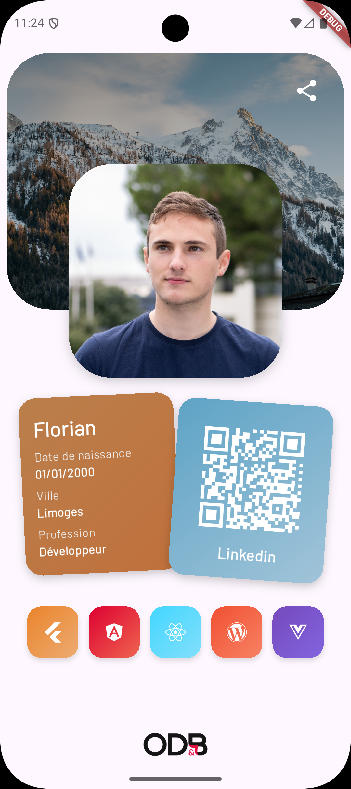

# 🧱 TP1 – Carte de profil interactive

## 🎯 Objectifs
- Découvrir la structure d'un projet Flutter
- Manipuler les widgets de base (`Column`, `Row`, `Stack`, `Image`, `Text`, `Icon`)
- Styliser son interface avec des gradients et des ombres
- Gérer les interactions (ouvrir un lien, partager une info)
- Créer des widgets personnalisés réutilisables

🕐 **Durée estimée : 2 à 3 heures**

---



## 🎨 Deux approches possibles

Tu as **deux options** pour réaliser ce TP :

### Option 1 : Suivre le tutoriel guidé (Recommandé pour débuter)
Suis les étapes ci-dessous pour créer une carte de profil moderne avec des cartes tournées, des gradients et des icônes cliquables. Cette approche te permet d'apprendre progressivement les concepts Flutter.

### Option 2 : Design libre inspiré de Dribbble (Pour les créatifs)
Si tu préfères créer ton propre design, tu peux t'inspirer d'un design mobile sur **[Dribbble](https://dribbble.com/)**.

**Recherches suggérées sur Dribbble :**
- "profile card mobile"
- "portfolio app ui"
- "user profile design"
- "contact card mobile"

**📋 Consignes pour l'option libre :**
- ✅ Utilise au minimum 4 widgets différents parmi : `Column`, `Row`, `Stack`, `Image`, `Text`, `Icon`, `Container`, `Card`
- ✅ Implémente au moins une interaction (`url_launcher` ou `share_plus`)
- ✅ Stylise ton interface (couleurs, marges, alignements, ombres)
- ✅ Crée au moins 2 widgets personnalisés réutilisables
- ✅ Ajoute tes informations personnelles (nom, photo, bio, projets, compétences, etc.)

**💡 Conseil :** Même si tu choisis l'option libre, tu peux consulter les étapes du tutoriel pour comprendre comment implémenter certains widgets ou fonctionnalités.

> **Note importante** : Quelle que soit l'option choisie, ton projet sera évalué selon le même barème (voir fin du document). L'option libre demande plus d'autonomie mais permet d'exprimer ta créativité.

---

## 🪜 Étape 1 — Créer le projet et installer les dépendances

1. Ouvre ton terminal et exécute :
   ```bash
   flutter create tp1_nom_prenom
   cd tp1_nom_prenom
   ```

2. Ouvre le dossier dans VS Code ou Android Studio.

3. Installe les dépendances nécessaires en exécutant ces commandes dans ton terminal :
   ```bash
   flutter pub add url_launcher share_plus font_awesome_flutter google_fonts
   ```

   > **💡 Pourquoi ces packages ?**
   > - `url_launcher` : Permet d'ouvrir des liens externes (sites web, LinkedIn, etc.)
   > - `share_plus` : Permet de partager du contenu depuis ton app
   > - `font_awesome_flutter` : Donne accès à des milliers d'icônes professionnelles (Flutter, React, Angular, etc.)
   > - `google_fonts` : Permet d'utiliser facilement les polices Google Fonts
   >
   > **💡 Qu'est-ce que `flutter pub add` ?**
   > Cette commande ajoute automatiquement les packages à ton fichier `pubspec.yaml` et les télécharge. Plus besoin de modifier le fichier manuellement ni de lancer `flutter pub get` !

4. Crée un dossier `assets/images/` et ajoute-y les images suivantes :
   - `background.jpg` : une image de fond (paysage, texture, couleur)
   - `profil.png` : ta photo de profil
   - `qrcode.png` : un QR code vers ton LinkedIn ou autre
   - `logo.png` : un petit logo (optionnel)

   Puis déclare-les dans le fichier `pubspec.yaml` :
   ```yaml
   flutter:
     assets:
       - assets/images/
   ```

---

## 🪜 Étape 2 — Préparer la structure de base

Ouvre `lib/main.dart` et reprend cet exemple :

```dart
import 'package:flutter/material.dart';
import 'package:font_awesome_flutter/font_awesome_flutter.dart';
import 'package:google_fonts/google_fonts.dart';
import 'package:share_plus/share_plus.dart';
import 'package:url_launcher/url_launcher.dart';

void main() {
  runApp(const MyApp());
}

class MyApp extends StatelessWidget {
  const MyApp({super.key});

  @override
  Widget build(BuildContext context) {
    return MaterialApp(
      theme: ThemeData(textTheme: GoogleFonts.barlowTextTheme()),
      title: 'Flutter Demo',
      home: const PortfolioPage(),
    );
  }
}

class PortfolioPage extends StatelessWidget {
  const PortfolioPage({super.key});

  @override
  Widget build(BuildContext context) {
    return Scaffold(
      body: SafeArea(
        child: Column(
          children: [
            // On va ajouter nos widgets ici étape par étape
            const Center(child: Text('Hello Portfolio!')),
          ],
        ),
      ),
    );
  }
}
```

> **💡 Quelques explications :**
> - **SafeArea** : S'assure que le contenu ne passe pas sous la barre de statut ou les encoches de l'écran
> - **GoogleFonts.barlowTextTheme()** : Applique la police Barlow à toute l'application (moderne et lisible)
> - **StatelessWidget** : Widget sans état qui ne change pas. Parfait pour notre page portfolio qui affiche simplement des informations statiques

👉 Lance ton application (`flutter run`) pour vérifier qu'elle fonctionne.

---

## 🪜 Étape 3 — Créer le header avec photo de profil

On va créer un widget personnalisé `ProfileHeader` qui affiche une image de fond et une photo de profil par-dessus.

**Reprend cette classe à la fin de ton fichier** :

```dart
class ProfileHeader extends StatelessWidget {
  final String backgroundImage;
  final String profileImage;

  const ProfileHeader({
    super.key,
    required this.backgroundImage,
    required this.profileImage,
  });

  @override
  Widget build(BuildContext context) {
    return Padding(
      padding: const EdgeInsets.all(8),
      child: Stack(
        alignment: Alignment.center,
        children: [
          // Image de fond
          Container(
            height: 300,
            width: double.infinity,
            clipBehavior: Clip.hardEdge,
            decoration: BoxDecoration(
              borderRadius: const BorderRadius.all(Radius.circular(50)),
              image: DecorationImage(
                image: AssetImage(backgroundImage),
                fit: BoxFit.cover,
              ),
            ),
            child: Container(
              decoration: BoxDecoration(
                gradient: LinearGradient(
                  colors: [
                    Colors.black.withAlpha(100),
                    Colors.black.withAlpha(50),
                  ],
                  begin: Alignment.topCenter,
                  end: Alignment.bottomCenter,
                ),
              ),
            ),
          ),
          // Bouton partager en haut à droite
          Positioned(
            top: 20,
            right: 20,
            child: IconButton(
              icon: const Icon(Icons.share, color: Colors.white, size: 30),
              onPressed: () {
                Share.share('Découvrez mon portfolio !');
              },
            ),
          ),
          // Photo de profil qui déborde en bas
          Positioned(
            bottom: 0,
            child: Transform.translate(
              offset: const Offset(0, 80),
              child: Container(
                height: 250,
                width: 250,
                clipBehavior: Clip.hardEdge,
                decoration: BoxDecoration(
                  boxShadow: [
                    BoxShadow(
                      color: Colors.black.withAlpha(50),
                      blurRadius: 10,
                      offset: const Offset(0, 4),
                    ),
                  ],
                  borderRadius: BorderRadius.circular(50),
                  image: DecorationImage(
                    image: AssetImage(profileImage),
                    fit: BoxFit.cover,
                  ),
                ),
              ),
            ),
          ),
        ],
      ),
    );
  }
}
```

> **💡 Pourquoi ces widgets ?**
> - **Stack** : Empile des widgets les uns sur les autres (comme des calques Photoshop)
> - **Positioned** : Place précisément un widget dans un Stack
> - **Transform.translate** : Déplace le widget (ici la photo déborde vers le bas avec `Offset(0, 80)`)
> - **LinearGradient** : Crée un dégradé pour assombrir légèrement l'image de fond
> - **BoxShadow** : Ajoute une ombre portée pour donner du relief

**Maintenant utilise ce widget dans `PortfolioPage`**, remplace le contenu de `children:` par :

```dart
children: [
  const ProfileHeader(
    backgroundImage: 'assets/images/background.jpg',
    profileImage: 'assets/images/profil.png',
  ),
  const SizedBox(height: 80),
  // On va ajouter la suite ici
],
```

✅ Tu dois maintenant voir ton image de fond avec ta photo de profil qui déborde en bas !

---

## 🪜 Étape 4 — Créer la carte d'informations (InfoCard)

On va créer une belle carte avec tes infos personnelles (nom, date de naissance, ville, profession).

**Ajoute cette classe à la fin du fichier** :

```dart
class InfoCard extends StatelessWidget {
  final String name;
  final String birthDate;
  final String city;
  final String profession;

  const InfoCard({
    super.key,
    required this.name,
    required this.birthDate,
    required this.city,
    required this.profession,
  });

  @override
  Widget build(BuildContext context) {
    return Container(
      padding: const EdgeInsets.all(16),
      decoration: BoxDecoration(
        boxShadow: [
          BoxShadow(
            color: Colors.black.withAlpha(50),
            blurRadius: 8,
            offset: const Offset(0, 4),
          ),
        ],
        gradient: const LinearGradient(
          colors: [Color(0xffba7f4c), Color.fromARGB(255, 192, 112, 59)],
          begin: Alignment.topLeft,
          end: Alignment.bottomRight,
        ),
        borderRadius: BorderRadius.circular(20),
      ),
      child: Column(
        crossAxisAlignment: CrossAxisAlignment.start,
        mainAxisAlignment: MainAxisAlignment.spaceAround,
        children: [
          Text(
            name,
            style: const TextStyle(
              color: Colors.white,
              fontSize: 24,
              fontWeight: FontWeight.bold,
            ),
          ),
          InfoField(label: 'Date de naissance', value: birthDate),
          InfoField(label: 'Ville', value: city),
          InfoField(label: 'Profession', value: profession),
        ],
      ),
    );
  }
}

class InfoField extends StatelessWidget {
  final String label;
  final String value;

  const InfoField({super.key, required this.label, required this.value});

  @override
  Widget build(BuildContext context) {
    return Column(
      crossAxisAlignment: CrossAxisAlignment.start,
      children: [
        Text(
          label,
          style: TextStyle(color: Colors.grey.shade200),
        ),
        Text(
          value,
          style: const TextStyle(
            color: Colors.white,
            fontWeight: FontWeight.w700,
          ),
        ),
      ],
    );
  }
}
```

> **💡 Explications :**
> - **LinearGradient** : Crée un beau dégradé de couleur (ici orange/marron)
> - **CrossAxisAlignment.start** : Aligne le texte à gauche
> - **MainAxisAlignment.spaceAround** : Répartit l'espace autour des éléments
> - On a créé un widget `InfoField` pour éviter de répéter le code pour chaque champ

---

## 🪜 Étape 5 — Créer la carte QR Code

**Ajoute cette classe** :

```dart
class QrCard extends StatelessWidget {
  final String qrCodeImage;
  final String label;

  const QrCard({super.key, required this.qrCodeImage, required this.label});

  @override
  Widget build(BuildContext context) {
    return Container(
      padding: const EdgeInsets.all(16),
      decoration: BoxDecoration(
        boxShadow: [
          BoxShadow(
            color: Colors.black.withAlpha(50),
            blurRadius: 8,
            offset: const Offset(0, 4),
          ),
        ],
        gradient: const LinearGradient(
          colors: [Color(0xFF5ea3c5), Color(0xFFa1c4d9)],
          begin: Alignment.topLeft,
          end: Alignment.bottomRight,
        ),
        borderRadius: BorderRadius.circular(20),
      ),
      child: Column(
        children: [
          Image.asset(qrCodeImage, width: double.infinity),
          Text(
            label,
            style: const TextStyle(
              color: Colors.white,
              fontSize: 18,
              fontWeight: FontWeight.bold,
            ),
          ),
        ],
      ),
    );
  }
}
```

> **💡 Pourquoi ?** Cette carte utilise le même principe que l'InfoCard, mais avec un gradient bleu et affiche une image de QR code.

---

## 🪜 Étape 6 — Assembler les deux cartes côte à côte avec des rotations

Maintenant on va placer nos deux cartes côte à côte, et les faire légèrement tourner pour un effet moderne !

**Dans `PortfolioPage`, ajoute après le `SizedBox(height: 80)` :**

```dart
Padding(
  padding: const EdgeInsets.all(16),
  child: IntrinsicHeight(
    child: Row(
      children: [
        // Carte d'info (légèrement tournée à gauche)
        Expanded(
          child: Transform.rotate(
            angle: -0.05,
            child: Transform.translate(
              offset: const Offset(10, -3),
              child: const InfoCard(
                name: 'Florian',
                birthDate: '01/01/2000',
                city: 'Limoges',
                profession: 'Développeur',
              ),
            ),
          ),
        ),
        const SizedBox(width: 16),
        // Carte QR Code (légèrement tournée à droite)
        Expanded(
          child: Transform.rotate(
            angle: 0.07,
            child: Transform.translate(
              offset: const Offset(-10, 5),
              child: const QrCard(
                qrCodeImage: 'assets/images/qrcode.png',
                label: 'Linkedin',
              ),
            ),
          ),
        ),
      ],
    ),
  ),
),
const SizedBox(height: 20),
```

> **💡 Les transformations expliquées :**
> - **Transform.rotate** : Fait tourner le widget (angle en radians : 0.05 ≈ 3 degrés)
> - **Transform.translate** : Déplace le widget (offset en pixels)
> - **IntrinsicHeight** : Force les deux cartes à avoir la même hauteur
> - **Expanded** : Chaque carte prend 50% de la largeur disponible

> **👉 Modifie les valeurs !** Change ton nom, ta date de naissance, ta ville et ta profession.

✅ Tu dois voir tes deux cartes côte à côte avec un léger effet de rotation !

---

## 🪜 Étape 7 — Ajouter les icônes de technologies avec liens cliquables

On va créer une rangée d'icônes représentant différentes technologies. Quand on clique dessus, ça ouvre le site officiel !

**Ajoute ces classes à la fin du fichier** :

```dart
class TechIconsRow extends StatelessWidget {
  const TechIconsRow({super.key});

  @override
  Widget build(BuildContext context) {
    return const Padding(
      padding: EdgeInsets.symmetric(horizontal: 32),
      child: Row(
        mainAxisAlignment: MainAxisAlignment.spaceBetween,
        children: [
          TechIcon(
            icon: FontAwesomeIcons.flutter,
            gradientColors: [Color(0xFFEA842B), Color.fromARGB(255, 237, 171, 114)],
            url: 'https://flutter.dev',
          ),
          TechIcon(
            icon: FontAwesomeIcons.angular,
            gradientColors: [Color(0xffdd0031), Color.fromARGB(255, 239, 100, 79)],
            url: 'https://angular.dev',
          ),
          TechIcon(
            icon: FontAwesomeIcons.react,
            gradientColors: [Color(0xFF43D6FF), Color.fromARGB(255, 130, 223, 250)],
            url: 'https://react.dev',
          ),
          TechIcon(
            icon: FontAwesomeIcons.wordpress,
            gradientColors: [Color(0xfff05032), Color.fromARGB(255, 248, 130, 100)],
            url: 'https://wordpress.org',
          ),
          TechIcon(
            icon: FontAwesomeIcons.vuejs,
            gradientColors: [Color(0xff764abc), Color.fromARGB(255, 130, 100, 223)],
            url: 'https://vuejs.org',
          ),
        ],
      ),
    );
  }
}

class TechIcon extends StatelessWidget {
  final IconData icon;
  final List<Color> gradientColors;
  final String url;

  const TechIcon({
    super.key,
    required this.icon,
    required this.gradientColors,
    required this.url,
  });

  @override
  Widget build(BuildContext context) {
    return GestureDetector(
      onTap: () async {
        final uri = Uri.parse(url);
        if (await canLaunchUrl(uri)) {
          await launchUrl(uri, mode: LaunchMode.externalApplication);
        }
      },
      child: Container(
        width: 60,
        height: 60,
        alignment: Alignment.center,
        padding: const EdgeInsets.symmetric(horizontal: 8),
        decoration: BoxDecoration(
          boxShadow: [
            BoxShadow(
              color: Colors.black.withAlpha(30),
              blurRadius: 4,
              offset: const Offset(0, 4),
            ),
          ],
          gradient: LinearGradient(
            colors: gradientColors,
            begin: Alignment.topLeft,
            end: Alignment.bottomRight,
          ),
          borderRadius: BorderRadius.circular(16),
        ),
        child: FaIcon(icon, color: Colors.white),
      ),
    );
  }
}
```

> **💡 Nouveaux concepts importants :**
> - **GestureDetector** : Détecte les gestes (ici, le tap/clic)
> - **url_launcher** :
>   - `canLaunchUrl()` : Vérifie si l'URL peut être ouverte
>   - `launchUrl()` : Ouvre l'URL dans le navigateur
>   - `LaunchMode.externalApplication` : Force l'ouverture dans le navigateur externe
> - **async/await** : Permet d'attendre que l'opération se termine avant de continuer
> - **FaIcon** : Icône de Font Awesome (plus d'options que les icônes Material)

**Ajoute ce widget dans `PortfolioPage` après le `SizedBox(height: 20)` :**

```dart
const TechIconsRow(),
const Spacer(),
```

> **💡 Le Spacer** pousse tout le contenu suivant en bas de l'écran.

✅ Teste en cliquant sur les icônes, ça doit ouvrir les sites !

---

## 🪜 Étape 8 — Ajouter le logo en bas

**Dernière touche, ajoute en bas de la `Column` dans `PortfolioPage` :**

```dart
Image.asset('assets/images/logo.png', width: 100),
```

> Si tu n'as pas de logo, tu peux le remplacer par un simple texte :
> ```dart
> Text('Made with Flutter', style: TextStyle(color: Colors.grey)),
> ```

---

## ✅ Objectif final

À la fin du TP, ton application doit :
- Afficher une bannière avec photo de profil
- Montrer deux cartes stylisées (infos + QR code) avec effet de rotation
- Afficher une rangée d'icônes de technologies cliquables
- Avoir un bouton de partage fonctionnel
- Utiliser des gradients et des ombres pour un rendu sympatoche

---

## 🎨 Personnalisation

Maintenant que tu as la structure de base, personnalise ton portfolio :

### Couleurs et gradients
Change les couleurs des cartes pour qu'elles correspondent à ta charte graphique.

### Technologies
Ajoute ou remplace les technologies selon ce que tu maîtrises.

### Rotations
Change les angles de rotation pour des effets différents.

---

## 💾 Rendu attendu

- Un projet Flutter complet nommé : **`tp1_nom_prenom`**
- Une capture d'écran de ton application
- Un dépôt GitHub avec ton code
- **Si option design libre** : Ajoute dans ton README le lien vers le(s) design(s) Dribbble qui t'a inspiré

---

## 🧮 Barème de notation

**Ce barème s'applique aux deux options (tutoriel guidé ou design libre)**

| Critère | Détails | Points |
|----------|----------|--------|
| **Structure du projet** | Organisation des fichiers, code clair, indentation correcte | 3 |
| **Widgets personnalisés** | Création et utilisation de widgets réutilisables (minimum 2) | 4 |
| **Code et bonnes pratiques** | Respect des conventions Flutter/Dart, pas d'erreurs, code lisible | 2 |
| **Affichage du profil** | Présentation des informations personnelles (photo, nom, infos, etc.) | 3 |
| **Interactions** | Fonctionnalités interactives (liens cliquables, partage, etc.) | 3 |
| **Design et esthétique** | Qualité visuelle, cohérence, utilisation de styles (couleurs, marges, ombres) | 3 |
| **Créativité et originalité** | Personnalisation du design, choix esthétiques, initiative | 2 |
| **Total** |  | **/20** |

> **Pour l'option design libre** : Le critère "Créativité et originalité" sera valorisé si tu proposes un design innovant et bien réalisé.

### 🎁 Bonus (+2 points possibles)

#### Bonus 1 : Animations (+1 point)
Ajouter une animation au tap sur les TechIcon (scale, rotation, etc.) avec `AnimatedContainer` ou `Hero`.

#### Bonus 2 : Partage d'image (+1 point)
Modifier le bouton de partage pour partager une image depuis les assets (une capture d'écran de ton profil) avec `share_plus`.

---

## 💡 Conseils

### Conseils généraux
- **Teste régulièrement** : Lance `flutter run` après chaque étape pour voir tes changements
- **Utilise tes propres images** : Remplace les images par les tiennes pour un rendu unique
- **Joue avec les couleurs** : Trouve des palettes sur [coolors.co](https://coolors.co) ou [color.adobe.com](https://color.adobe.com)
- **Explore Font Awesome** : Cherche d'autres icônes sur [fontawesome.com/icons](https://fontawesome.com/icons)
- **Debug les URLs** : Si un lien ne s'ouvre pas, vérifie la console pour les erreurs

---

## 🔧 Problèmes courants

**Les images ne s'affichent pas ?**
- Vérifie que les fichiers sont dans `assets/images/`
- Vérifie la déclaration dans `pubspec.yaml`
- Relance `flutter pub get`