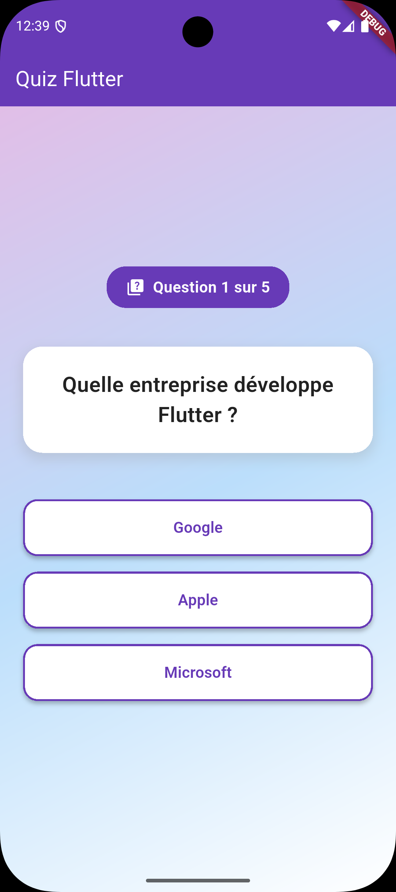
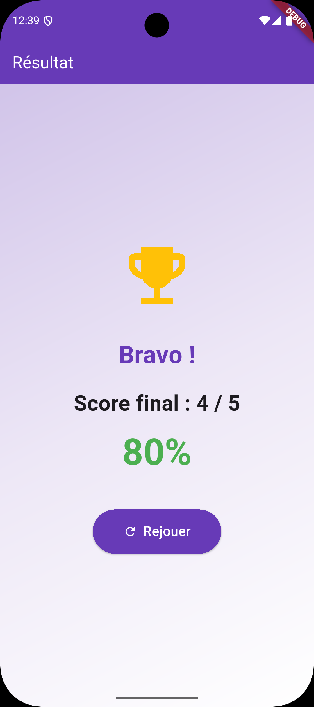

# 🧱 TP2 – Quiz interactif avec score

## 🎯 Objectifs
- Découvrir la gestion de l’état avec `setState()`  
- Manipuler des listes et des modèles de données simples  
- Créer une interface de quiz à choix multiples  
- Calculer et afficher un score final  

🕐 **Durée estimée : 2 à 3 heures**



---

## 🪜 Étape 1 — Préparer la structure du quiz

Crée un fichier `lib/quiz_page.dart` et ajoute :

```dart
import 'package:flutter/material.dart';

// Modèles de données typés
class Answer {
  final String text;
  final bool isCorrect;

  Answer({required this.text, required this.isCorrect});
}

class Question {
  final String question;
  final List<Answer> answers;

  Question({required this.question, required this.answers});
}

class QuizPage extends StatefulWidget {
  const QuizPage({super.key});

  @override
  State<QuizPage> createState() => _QuizPageState();
}
```

> **💡 Pourquoi StatefulWidget ?**
> Un **StatefulWidget** est un widget qui peut "se souvenir" de choses et changer au fil du temps. Ici, ton quiz doit se souvenir de la question actuelle et du score. C'est différent d'un **StatelessWidget** qui est figé et ne change jamais. Pense à StatefulWidget comme une page avec un compteur qui bouge, et StatelessWidget comme une pancarte fixe.

```dart
class _QuizPageState extends State<QuizPage> {
  int currentQuestion = 0;
  int score = 0;

  final List<Question> questions = [
    Question(
      question: 'Quelle entreprise développe Flutter ?',
      answers: [
        Answer(text: 'Google', isCorrect: true),
        Answer(text: 'Apple', isCorrect: false),
        Answer(text: 'Microsoft', isCorrect: false),
      ],
    ),
    Question(
      question: 'Quel langage est utilisé avec Flutter ?',
      answers: [
        Answer(text: 'Kotlin', isCorrect: false),
        Answer(text: 'Dart', isCorrect: true),
        Answer(text: 'Swift', isCorrect: false),
      ],
    ),
  ];

  void answerQuestion(bool isCorrect) {
    setState(() {
      if (isCorrect) score++;
      currentQuestion++;
    });
  }

  @override
  Widget build(BuildContext context) {
    if (currentQuestion >= questions.length) {
      return Scaffold(
        appBar: AppBar(title: const Text('Résultat')),
        body: Center(
          child: Column(
            mainAxisAlignment: MainAxisAlignment.center,
            children: [
              Text('Score final : $score / ${questions.length}',
                  style: const TextStyle(fontSize: 24)),
              const SizedBox(height: 20),
              ElevatedButton(
                onPressed: () {
                  setState(() {
                    currentQuestion = 0;
                    score = 0;
                  });
                },
                child: const Text('Rejouer'),
              )
            ],
          ),
        ),
      );
    }

    final question = questions[currentQuestion];

    return Scaffold(
      appBar: AppBar(title: const Text('Quiz Flutter')),
      body: Padding(
        padding: const EdgeInsets.all(16),
        child: Column(
          mainAxisAlignment: MainAxisAlignment.center,
          children: [
            Text(
              question.question,  // Pas de cast ! Typage direct
              style: const TextStyle(fontSize: 20),
              textAlign: TextAlign.center,
            ),
            const SizedBox(height: 20),
            ...question.answers.map((answer) {
              return Container(
                width: double.infinity,
                margin: const EdgeInsets.symmetric(vertical: 6),
                child: ElevatedButton(
                  onPressed: () => answerQuestion(answer.isCorrect),
                  child: Text(answer.text),  // Pas de cast !
                ),
              );
            }),
          ],
        ),
      ),
    );
  }
}
```

> **💡 Notions clés expliquées :**
> - **StatefulWidget** : Un widget qui peut "se souvenir" de choses et changer au fil du temps (contrairement à StatelessWidget qui est figé). Ici, le quiz doit se souvenir de la question actuelle et du score.
> - **setState()** : Dit à Flutter "j'ai changé quelque chose, redessine l'écran !". Sans setState(), même si tu modifies `currentQuestion`, l'interface ne se met pas à jour.
> - **Cycle de vie - initState() vs build()** :
>   - `initState()` : Appelé UNE SEULE FOIS quand le widget est créé. Parfait pour charger des données initiales ou configurer des écouteurs.
>   - `build()` : Appelé À CHAQUE FOIS que le widget doit se redessiner (après chaque `setState()`). C'est ici que tu construis ton interface.
>   - Règle d'or : Ce qui doit se faire qu'une fois → `initState()`. Ce qui décrit l'interface → `build()`.
> - **`...` (spread operator)** : "Décompresse" une liste pour en étaler les éléments. Utilisé ici pour afficher tous les boutons de réponses.
> - **`.map()`** : Transforme chaque élément d'une liste. Pour chaque réponse, on crée un bouton.

Puis modifie ton `lib/main.dart` :

```dart
import 'package:flutter/material.dart';
import 'quiz_page.dart';

void main() => runApp(const MyApp());

class MyApp extends StatelessWidget {
  const MyApp({super.key});

  @override
  Widget build(BuildContext context) {
    return MaterialApp(
      title: 'TP2 - Quiz Flutter',
      theme: ThemeData(primarySwatch: Colors.deepPurple),
      home: const QuizPage(),
    );
  }
}
```

✅ Teste ton quiz. Tu devrais pouvoir répondre à plusieurs questions et obtenir un score final.

---

## 🪜 Étape 2 — Améliorer l’expérience utilisateur

Ajoute :
- un compteur de progression (“Question 2 sur 3”)  
- un feedback visuel lorsque tu cliques sur une réponse (couleur différente pour bonne/mauvaise réponse)  

Tu peux utiliser un `SnackBar` :
```dart
ScaffoldMessenger.of(context).showSnackBar(
  SnackBar(content: Text(isCorrect ? 'Bonne réponse !' : 'Mauvaise réponse...')),
);
```

---

## 🪜 Étape 3 — Ajouter un design plus travaillé

Quelques idées :
- Une couleur différente par question  
- Un fond avec un `LinearGradient`  
- Des icônes (`Icons.check`, `Icons.close`) pour rendre le quiz plus visuel  

Inspire-toi des guidelines Material Design !

---

## ✅ Objectif final

À la fin du TP, ton application doit :
- Afficher une série de **questions à choix multiples**
- Gérer la **progression et le score**
- Afficher un **écran de résultat** clair et redémarrer le quiz
- Avoir un **design personnalisé et agréable**



---

## 💾 Rendu attendu

- Projet Flutter complet nommé : **`tp2_nom_prenom`**  
- Capture d’écran du quiz en cours et du score final  
- Lien GitHub

---

## 🧮 Barème de notation

| Critère | Détails | Points |
|----------|----------|--------|
| **Structure du projet** | Organisation des fichiers, code clair, indentation correcte | 3 |
| **Gestion d’état (`setState`)** | Bonne utilisation de la logique et mise à jour de l’UI | 3 |
| **Affichage des questions** | Liste fonctionnelle et bien présentée | 2 |
| **Calcul du score** | Score exact et affiché correctement | 2 |
| **Interaction et feedback** | Boutons réactifs, progression claire | 2 |
| **Design et ergonomie** | UI soignée, marges, cohérence visuelle | 3 |
| **Code et bonnes pratiques** | Respect des conventions Flutter/Dart, propreté du code | 2 |
| **Créativité et personnalisation** | Améliorations visuelles, animations, styles | 3 |
| **Total** |  | **/20 + 2 bonus** |

---

### 🎁 Bonus (+2 points possibles)
1. Ajouter un **timer** pour chaque question (compte à rebours)
2. Créer une **page “Meilleurs scores”** qui affiche les meilleurs résultats enregistrés localement

---

## 💡 Conseils
- Commence simple, vérifie que la logique fonctionne avant d'ajouter du style.
- Si ton quiz plante, affiche des `print()` pour suivre les valeurs.
- Découpe ton code en widgets pour plus de clarté (`QuestionWidget`, `AnswerButton`, etc.).
- Si tu veux aller plus loin : transforme le quiz en un mini-jeu à thèmes (culture, cinéma, dev...).

### 📚 Aller plus loin : Quand dépasser `setState()` ?
Dans ce TP, `setState()` est parfait pour gérer l'état local simple (score, question actuelle). Mais il montre ses limites quand :
- Tu dois partager des données entre plusieurs pages (ex : score accessible partout)
- Ton état devient complexe avec beaucoup de variables interdépendantes
- Tu veux séparer la logique métier de l'interface

Pour des applications plus grandes, explore des solutions de gestion d'état comme **Provider**, **Riverpod** ou **Bloc**. Mais pour ce TP, `setState()` reste le bon choix !
