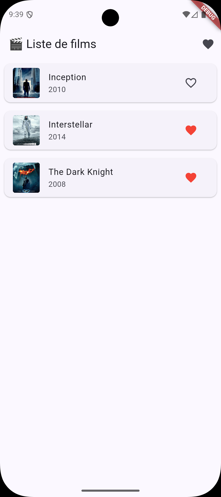
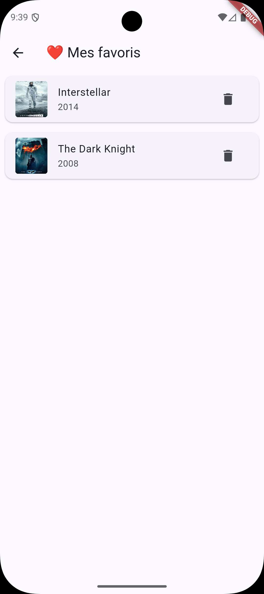

# 🧱 TP3 – Liste de films avec favoris (JSON local)

## 🎯 Objectifs
- Charger et afficher des données dynamiques depuis un JSON local
- Utiliser des widgets de liste (`ListView`, `ListTile`, `GridView`)
- Gérer des favoris localement
- Structurer son code en plusieurs fichiers
- Découvrir les tests unitaires en Flutter  

🕐 **Durée estimée : 2 à 3 heures**



---

## 🪜 Étape 1 — Créer le projet

1. Dans ton terminal :
   ```bash
   flutter create tp3_nom_prenom
   cd tp3_nom_prenom
   ```
2. Ouvre le dossier dans VS Code ou Android Studio.  
3. Mets à jour les packages :
   ```bash
   flutter pub get
   ```
4. Crée un dossier `assets/data/` et ajoute un fichier `movies.json` :
   ```json
   [
     {
       "title": "Inception",
       "year": 2010,
       "poster": "https://image.tmdb.org/t/p/w500/aej3LRUga5rhgkmRP6XMFw3ejbl.jpg",
       "description": "Un voleur qui s'infiltre dans les rêves des gens pour voler leurs secrets se voit confier une mission impossible : implanter une idée dans l'esprit d'un PDG."
     },
     {
       "title": "Interstellar",
       "year": 2014,
       "poster": "https://image.tmdb.org/t/p/w500/1pnigkWWy8W032o9TKDneBa3eVK.jpg",
       "description": "Une équipe d'explorateurs voyage à travers un trou de ver dans l'espace pour assurer la survie de l'humanité face à la fin de la Terre."
     },
     {
       "title": "The Dark Knight",
       "year": 2008,
       "poster": "https://image.tmdb.org/t/p/w500/pyNXnq8QBWoK3b37RS6C3axwUOy.jpg",
       "description": "Batman affronte le Joker, un criminel chaotique qui plonge Gotham dans l'anarchie et force le chevalier noir à affronter ses propres limites morales."
     }
   ]
   ```
5. Déclare les assets dans `pubspec.yaml` :
   ```yaml
   flutter:
     assets:
       - assets/data/movies.json
   ```

---

## 🪜 Étape 2 — Charger les données du JSON

Crée un fichier `lib/service/movie_service.dart` :

```dart
import 'dart:convert';
import 'package:flutter/services.dart' show rootBundle;

class Movie {
  final String title;
  final int year;
  final String poster;
  final String description;

  Movie({
    required this.title,
    required this.year,
    required this.poster,
    required this.description,
  });

  factory Movie.fromJson(Map<String, dynamic> json) {
    return Movie(
      title: json['title'],
      year: json['year'],
      poster: json['poster'],
      description: json['description'],
    );
  }
}

class MovieService {
  Future<List<Movie>> loadLocalMovies() async {
    final data = await rootBundle.loadString('assets/data/movies.json');
    final List<dynamic> jsonList = json.decode(data);
    return jsonList.map((json) => Movie.fromJson(json)).toList();
  }
}
```

> **💡 Notions clés expliquées :**
> - **Future** : Représente une valeur qui sera disponible "dans le futur". Comme commander une pizza : tu n'as pas encore la pizza (Future), mais tu l'auras bientôt.
> - **async/await** : `async` dit "cette fonction va prendre du temps", `await` dit "attends ici que ça se termine". C'est comme attendre que ton café soit prêt avant de le boire.
> - **factory constructor** : Une méthode spéciale pour créer des objets. Ici, `Movie.fromJson()` transforme des données brutes JSON en objet Movie structuré.
> - **rootBundle.loadString()** : Charge un fichier texte depuis les assets (comme lire un fichier sur le disque).

---

## 🪜 Étape 3 — Afficher la liste des films (version simple)

Commençons par créer une liste simple sans favoris pour bien comprendre les bases.

Crée un fichier `lib/movie_list_page.dart` :

```dart
import 'package:flutter/material.dart';
import 'service/movie_service.dart';

class MovieListPage extends StatefulWidget {
  final MovieService movieService;

  const MovieListPage({super.key, required this.movieService});

  @override
  State<MovieListPage> createState() => _MovieListPageState();
}

class _MovieListPageState extends State<MovieListPage> {
  List<Movie> movies = [];

  @override
  void initState() {
    super.initState();
    _loadMovies();
  }

  Future<void> _loadMovies() async {
    final loadedMovies = await widget.movieService.loadLocalMovies();
    setState(() => movies = loadedMovies);
  }

  @override
  Widget build(BuildContext context) {
    return Scaffold(
      appBar: AppBar(
        title: const Text('🎬 Liste de films'),
      ),
      body: movies.isEmpty
          ? const Center(child: CircularProgressIndicator())
          : ListView.builder(
              itemCount: movies.length,
              itemBuilder: (context, index) {
                final movie = movies[index];
                return Card(
                  margin: const EdgeInsets.all(8),
                  child: ListTile(
                    leading: ClipRRect(
                      borderRadius: BorderRadius.circular(4),
                      child: Image.network(
                        movie.poster,
                        width: 50,
                        height: 75,
                        fit: BoxFit.cover,
                        errorBuilder: (_, __, ___) => Container(
                          width: 50,
                          height: 75,
                          color: Colors.grey[300],
                          child: const Icon(Icons.movie),
                        ),
                      ),
                    ),
                    title: Text(movie.title),
                    subtitle: Text('${movie.year}'),
                  ),
                );
              },
            ),
    );
  }
}
```

> **💡 Notions clés expliquées :**
> - **widget.movieService** : Dans une classe `State`, on accède aux propriétés du `StatefulWidget` parent via `widget.`.
> - **initState()** : Appelé UNE SEULE FOIS quand le widget est créé. Parfait pour charger des données initiales.
> - **ListView.builder()** : Crée une liste optimisée qui ne construit que les éléments visibles à l'écran (performant pour de longues listes).
> - **ClipRRect** : Découpe un widget avec des coins arrondis. Ici, on arrondit les angles des images de films.
> - **errorBuilder** : Fonction appelée quand une image ne charge pas. Permet d'afficher un widget de remplacement (icône, placeholder, etc.).

✅ Lance ton app avec `flutter run` : tu devrais voir une liste de films !

---

## 🪜 Étape 4 — Ajouter la gestion des favoris

Maintenant, ajoutons la possibilité de mettre des films en favoris. On va :
1. Extraire le code de la carte dans un widget `MovieCard` réutilisable
2. Ajouter la gestion des favoris
3. Créer une page dédiée aux favoris

### 4.1 — Créer le widget MovieCard réutilisable

Ajoute ce widget **à la fin** du fichier `lib/movie_list_page.dart` :

```dart
class MovieCard extends StatelessWidget {
  final Movie movie;
  final bool isFavorite;
  final VoidCallback onFavoriteTap;
  final IconData? favoriteIcon;

  const MovieCard({
    super.key,
    required this.movie,
    required this.isFavorite,
    required this.onFavoriteTap,
    this.favoriteIcon,
  });

  @override
  Widget build(BuildContext context) {
    return Card(
      margin: const EdgeInsets.all(8),
      child: ListTile(
        leading: ClipRRect(
          borderRadius: BorderRadius.circular(4),
          child: Image.network(
            movie.poster,
            width: 50,
            height: 75,
            fit: BoxFit.cover,
            errorBuilder: (_, __, ___) => Container(
              width: 50,
              height: 75,
              color: Colors.grey[300],
              child: const Icon(Icons.movie),
            ),
          ),
        ),
        title: Text(movie.title),
        subtitle: Text('${movie.year}'),
        trailing: IconButton(
          icon: Icon(
            favoriteIcon ?? (isFavorite ? Icons.favorite : Icons.favorite_border),
            color: isFavorite && favoriteIcon == null ? Colors.red : null,
          ),
          onPressed: onFavoriteTap,
        ),
      ),
    );
  }
}
```

> **💡 Notions clés expliquées :**
> - **Extraction de widget** : `MovieCard` est un widget séparé réutilisable. C'est une bonne pratique pour éviter la duplication de code.
> - **VoidCallback** : Type pour une fonction qui ne prend aucun paramètre et ne retourne rien. Équivalent à `void Function()`.

### 4.2 — Modifier MovieListPage pour utiliser MovieCard et gérer les favoris

Remplace la classe `_MovieListPageState` dans `lib/movie_list_page.dart` par :

```dart
class _MovieListPageState extends State<MovieListPage> {
  List<Movie> movies = [];
  final Set<String> favorites = {};

  @override
  void initState() {
    super.initState();
    _loadMovies();
  }

  Future<void> _loadMovies() async {
    final loadedMovies = await widget.movieService.loadLocalMovies();
    setState(() => movies = loadedMovies);
  }

  void toggleFavorite(String title) {
    setState(() {
      favorites.contains(title) ? favorites.remove(title) : favorites.add(title);
    });
  }

  @override
  Widget build(BuildContext context) {
    return Scaffold(
      appBar: AppBar(
        title: const Text('🎬 Liste de films'),
        actions: [
          IconButton(
            icon: const Icon(Icons.favorite),
            onPressed: () => Navigator.push(
              context,
              MaterialPageRoute(
                builder: (_) => FavoritesPage(
                  favorites: favorites,
                  movies: movies,
                  toggleFavorite: toggleFavorite,
                ),
              ),
            ),
          ),
        ],
      ),
      body: movies.isEmpty
          ? const Center(child: CircularProgressIndicator())
          : ListView.builder(
              itemCount: movies.length,
              itemBuilder: (context, index) => MovieCard(
                movie: movies[index],
                isFavorite: favorites.contains(movies[index].title),
                onFavoriteTap: () => toggleFavorite(movies[index].title),
              ),
            ),
    );
  }
}
```

> **💡 Notions clés expliquées :**
> - **Set** : Une collection qui ne peut pas contenir de doublons. Ici, `Set<String>` stocke les titres favoris (impossible d'ajouter deux fois le même film).
> - **Opérateur ternaire** : `condition ? siVrai : siFaux`. Ici, on l'utilise pour ajouter ou retirer un favori en une ligne.
> - **Navigator.push()** : Change de page en "empilant" une nouvelle page par-dessus l'actuelle (comme ajouter une carte sur un tas).

### 4.3 — Créer la page des favoris

Ajoute cette classe **à la fin** du fichier `lib/movie_list_page.dart` (avant `MovieCard`) :

```dart
class FavoritesPage extends StatefulWidget {
  final Set<String> favorites;
  final List<Movie> movies;
  final void Function(String) toggleFavorite;

  const FavoritesPage({
    super.key,
    required this.favorites,
    required this.movies,
    required this.toggleFavorite,
  });

  @override
  State<FavoritesPage> createState() => _FavoritesPageState();
}

class _FavoritesPageState extends State<FavoritesPage> {
  void _removeFavorite(String title) {
    widget.toggleFavorite(title);
    setState(() {});
  }

  @override
  Widget build(BuildContext context) {
    final favMovies = widget.movies.where((m) => widget.favorites.contains(m.title)).toList();

    return Scaffold(
      appBar: AppBar(title: const Text('❤️ Mes favoris')),
      body: favMovies.isEmpty
          ? const Center(child: Text('Aucun favori pour le moment.'))
          : ListView.builder(
              itemCount: favMovies.length,
              itemBuilder: (context, index) => MovieCard(
                movie: favMovies[index],
                isFavorite: true,
                onFavoriteTap: () => _removeFavorite(favMovies[index].title),
                favoriteIcon: Icons.delete,
              ),
            ),
    );
  }
}
```

> **💡 Notions clés expliquées :**
> - **where()** : Filtre une liste. Ici, on garde seulement les films dont le titre est dans les favoris.
> - **toList()** : Convertit le résultat du filtre en liste. Nécessaire car `where()` retourne un `Iterable`.
> - **Réutilisation de widget** : On utilise le même `MovieCard` pour la liste principale et les favoris, avec juste un paramètre différent (`favoriteIcon`).

✅ Teste ton app : tu peux maintenant ajouter des favoris et voir la page dédiée !

---

## 🪜 Étape 5 — Ajouter la page de détails

Dernière étape : créer une page de détails pour chaque film.

### 5.1 — Rendre MovieCard cliquable

Modifie le widget `MovieCard` dans `lib/movie_list_page.dart`. Entoure le `ListTile` avec un `InkWell` :

```dart
class MovieCard extends StatelessWidget {
  final Movie movie;
  final bool isFavorite;
  final VoidCallback onFavoriteTap;
  final IconData? favoriteIcon;

  const MovieCard({
    super.key,
    required this.movie,
    required this.isFavorite,
    required this.onFavoriteTap,
    this.favoriteIcon,
  });

  @override
  Widget build(BuildContext context) {
    return Card(
      margin: const EdgeInsets.all(8),
      child: InkWell(
        onTap: () => Navigator.push(
          context,
          MaterialPageRoute(
            builder: (_) => MovieDetailPage(
              movie: movie,
              isFavorite: isFavorite,
              onFavoriteTap: onFavoriteTap,
            ),
          ),
        ),
        child: ListTile(
          leading: ClipRRect(
            borderRadius: BorderRadius.circular(4),
            child: Image.network(
              movie.poster,
              width: 50,
              height: 75,
              fit: BoxFit.cover,
              errorBuilder: (_, __, ___) => Container(
                width: 50,
                height: 75,
                color: Colors.grey[300],
                child: const Icon(Icons.movie),
              ),
            ),
          ),
          title: Text(movie.title),
          subtitle: Text('${movie.year}'),
          trailing: IconButton(
            icon: Icon(
              favoriteIcon ?? (isFavorite ? Icons.favorite : Icons.favorite_border),
              color: isFavorite && favoriteIcon == null ? Colors.red : null,
            ),
            onPressed: onFavoriteTap,
          ),
        ),
      ),
    );
  }
}
```

> **💡 Notion clé :**
> - **InkWell** : Rend un widget cliquable avec un effet de "vague" visuel au toucher (Material Design).

### 5.2 — Créer la page de détails

Ajoute cette classe **à la fin** du fichier `lib/movie_list_page.dart` :

```dart
class MovieDetailPage extends StatefulWidget {
  final Movie movie;
  final bool initialIsFavorite;
  final VoidCallback onFavoriteTap;

  const MovieDetailPage({
    super.key,
    required this.movie,
    required bool isFavorite,
    required this.onFavoriteTap,
  }) : initialIsFavorite = isFavorite;

  @override
  State<MovieDetailPage> createState() => _MovieDetailPageState();
}

class _MovieDetailPageState extends State<MovieDetailPage> {
  late bool isFavorite;

  @override
  void initState() {
    super.initState();
    isFavorite = widget.initialIsFavorite;
  }

  void _toggleFavorite() {
    setState(() => isFavorite = !isFavorite);
    widget.onFavoriteTap();
  }

  @override
  Widget build(BuildContext context) {
    return Scaffold(
      appBar: AppBar(
        title: Text(widget.movie.title),
        actions: [
          IconButton(
            icon: Icon(
              isFavorite ? Icons.favorite : Icons.favorite_border,
              color: isFavorite ? Colors.red : null,
            ),
            onPressed: _toggleFavorite,
          ),
        ],
      ),
      body: SingleChildScrollView(
        child: Column(
          crossAxisAlignment: CrossAxisAlignment.start,
          children: [
            Image.network(
              widget.movie.poster,
              width: double.infinity,
              height: 400,
              fit: BoxFit.cover,
            ),
            Padding(
              padding: const EdgeInsets.all(16),
              child: Column(
                crossAxisAlignment: CrossAxisAlignment.start,
                children: [
                  Row(
                    children: [
                      const Icon(Icons.calendar_today, size: 16),
                      const SizedBox(width: 8),
                      Text('${widget.movie.year}', style: const TextStyle(fontSize: 16)),
                    ],
                  ),
                  const SizedBox(height: 20),
                  const Text(
                    'Synopsis',
                    style: TextStyle(fontSize: 20, fontWeight: FontWeight.bold),
                  ),
                  const SizedBox(height: 8),
                  Text(
                    widget.movie.description,
                    style: const TextStyle(fontSize: 16, height: 1.5),
                  ),
                ],
              ),
            ),
          ],
        ),
      ),
    );
  }
}
```



> **💡 Notions clés expliquées :**
> - **late** : Indique qu'une variable sera initialisée plus tard, mais avant d'être utilisée. Ici, `late bool isFavorite` est initialisée dans `initState()`.

✅ Teste ton app : clique sur un film pour voir sa page de détails avec le synopsis !

---

## 🪜 Étape 6 — Finaliser l'application avec le main.dart

Crée ou modifie le fichier `lib/main.dart` :

```dart
import 'package:flutter/material.dart';
import 'movie_list_page.dart';
import 'service/movie_service.dart';

final movieService = MovieService();

void main() => runApp(const MyApp());

class MyApp extends StatelessWidget {
  const MyApp({super.key});

  @override
  Widget build(BuildContext context) {
    return MaterialApp(
      title: 'TP3 - Liste de films',
      theme: ThemeData(
        colorScheme: ColorScheme.fromSeed(seedColor: Colors.indigo),
        useMaterial3: true,
      ),
      home: MovieListPage(movieService: movieService),
    );
  }
}
```

✅ Lance ton app avec `flutter run` : tu devrais maintenant avoir une application complète avec liste, favoris et détails !

---

## 🪜 Étape 7 — Améliorer l'interface (optionnel)

Quelques idées pour aller plus loin :
- Transformer la liste en **grille** (`GridView.builder`) avec un bouton pour basculer entre les modes
- Ajouter une **barre de recherche** (`TextField` + `setState`) pour filtrer les films par titre
- Mettre une **animation** sur les favoris (`AnimatedIcon` ou `Hero` pour les transitions)
- Ajouter un **tri** des films par année ou titre (avec un menu déroulant)
- Améliorer la **page de détails** : ajouter une note, un genre, des acteurs, etc.

---

## ✅ Objectif final

À la fin du TP, ton application doit :
- Charger des films depuis un **JSON local**
- Les afficher dans une **liste claire et responsive**
- Permettre de **mettre ou retirer des favoris**
- Afficher une **page séparée** listant uniquement les favoris
- Afficher une **page de détails** pour chaque film avec son synopsis
- Gérer les **erreurs de chargement d'images** avec un placeholder  

---

## 💾 Rendu attendu

- Projet complet nommé : **`tp3_nom_prenom`**
- Trois captures d'écran :
  - La liste principale des films
  - La page des favoris
  - La page de détails d'un film
- Lien GitHub du projet

---

## 🧮 Barème de notation

| Critère | Détails | Points |
|----------|----------|--------|
| **Structure du projet** | Fichiers bien organisés (`main`, `service`, `pages`) | 2 |
| **Chargement des données** | JSON bien lu et affiché sans erreur | 2 |
| **Affichage de la liste** | Liste lisible et responsive avec `MovieCard` | 2 |
| **Gestion des favoris** | Ajout/suppression fonctionnels sur liste et détails | 3 |
| **Page de détails** | Page complète avec poster, synopsis, année | 3 |
| **Navigation** | Transitions fluides entre les 3 pages | 2 |
| **Gestion des erreurs** | `errorBuilder` pour les images qui ne chargent pas | 2 |
| **Design et ergonomie** | Couleurs, marges, icônes, lisibilité | 2 |
| **Code et bonnes pratiques** | Extraction de widgets, style Flutter/Dart propre | 2 |
| **Total** |  | **/20 + 2 bonus** |

---

### 🎁 Bonus (+2 points possibles)

#### Bonus 1 : Tests unitaires pour MovieService (+1 point)
Créer un fichier `test/movie_service_test.dart` et écrire au moins 3 tests unitaires qui vérifient :
- Le chargement correct des données depuis le JSON
- Le parsing et la conversion en objets `Movie`
- Le nombre de films retournés correspond au JSON

#### Bonus 2 : GridView avec plusieurs modes d'affichage (+1 point)
Ajouter un bouton dans l'AppBar pour basculer entre deux modes d'affichage :
- Mode Liste (`ListView`) : affichage actuel
- Mode Grille (`GridView.builder`) : affichage en grille 2 colonnes avec cartes visuelles

#### Bonus 3 : Ajout de filtres et tri (+1 point)
Améliorer l'expérience utilisateur avec des fonctionnalités de filtrage :
- Ajouter un menu déroulant pour trier les films
- Ajouter une barre de recherche pour filtrer par titre

---

## 💡 Conseils
- Teste ton app sur plusieurs tailles d'écran.
- Utilise `FutureBuilder` si tu veux afficher le chargement plus proprement.
- Ajoute plus de films dans ton JSON pour tester le scroll et les performances.
- Garde ton code propre et bien séparé : c'est le début d'une vraie architecture Flutter !
- Pour les bonus tests, lance `flutter test` dans ton terminal pour exécuter tes tests unitaires.

### 🔧 Dépannage
**Problèmes d'affichage des images ?**
Si les images ne s'affichent pas correctement (notamment après un changement de réseau pendant le développement), essaie de redémarrer l'émulateur en **cold boot** :
1. Ferme l'émulateur
2. Dans Android Studio : **Tools > Device Manager**
3. Clique sur le menu ⋮ de ton émulateur
4. Sélectionne **Cold Boot Now**

Cela peut résoudre les problèmes de cache réseau et d'affichage des images.

### 🏗️ Architecture : Instance globale du service
Dans ce TP, `movieService` est définie comme une **instance globale** au niveau du `main.dart` et passée en paramètre à `MovieListPage`. Cela garantit qu'une seule instance du service existe dans toute l'application. C'est une bonne pratique car :
- Facilite les tests unitaires (on peut remplacer l'instance facilement)
- Permet d'ajouter facilement du cache ou de la configuration
- Prépare le terrain pour évoluer vers une API sans tout réécrire
- Évite de créer plusieurs instances inutiles du même service

### 📁 Organisation des fichiers
- `lib/pages/movie_list_page.dart`
- `lib/pages/favorites_page.dart`
- `lib/pages/movie_detail_page.dart`
- `lib/widgets/movie_card.dart`
- `lib/services/movie_service.dart`
- `lib/models/movie.dart`

Cette séparation améliore la maintenabilité et la testabilité du code.

### ⚠️ Limitations actuelles
- **Favoris non persistants** : Les favoris sont stockés en mémoire (`Set<String>`) et sont perdus à chaque redémarrage de l'application. Pour les conserver, il faudrait utiliser un système de stockage local comme `shared_preferences` ou `hive` !
